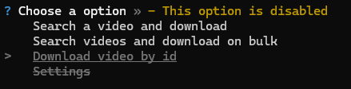

# Youtube-downloader
 This a own project trying to get youtube videos without go to a page weird or using api key, etc. Just search your video or with the id

## Installation

To install the project, follow these steps:

1. Clone the repository to your local machine.
        ```
        git clone https://github.com/kikf/Youtube-downloader.git
        ```

2. Navigate to the project directory.
        ```
        cd youtube-downloader
        ```

3. Install the required dependencies.
        ```
        npm install
        ```

## Usage

To use the project, follow these steps:

1. Run the application.
        ```
        node .
        ```

2. Open a menu. And select what you want



3. First option you can find any video just with the title, write any title and it will search videos.


4. Confirm if you want download the video or not


5. The video will be download on `videos` and enjoy the tool/program :D


Any suggest or fix bug/error please help. This is a small project , so enjoy it :D


On this project are using:

- [progress-estimator](https://www.npmjs.com/package/progress-estimator)
- [youtube-dl-exec](https://www.npmjs.com/package/youtube-dl-exec)
- [propmts](https://www.npmjs.com/package/prompts)
- [youtube-search-api](https://www.npmjs.com/package/youtube-search-api)
